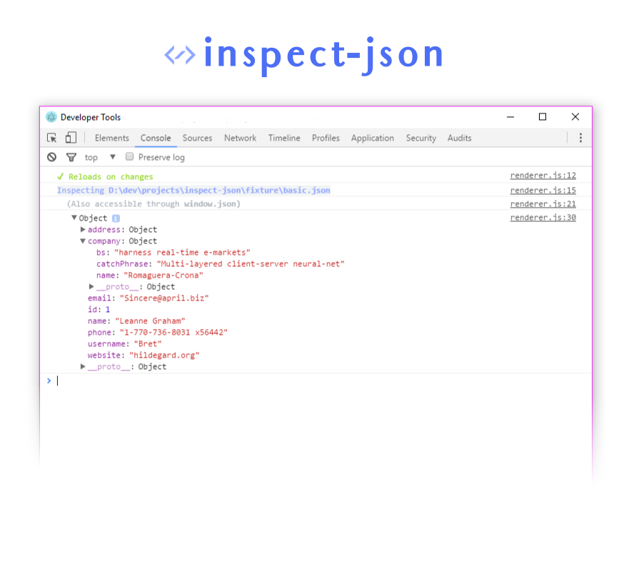

# inspect-json



**Robust manipulation and inspection of JSON data using the already familiar Chromium Devtools**

* Allows URLs and Files
* Reloads on file changes
* All Chrome Devtools features at hand!

>  **[Get It!]()**

## Examples

View a file:

```
> inspect-json example.json
```

View a file and don't react to file changes:

```
> inspect-json -n example.json
```

View JSON from a REST Endpoint

```
> inspect-json https://api.github.com/users/mbostock
```

